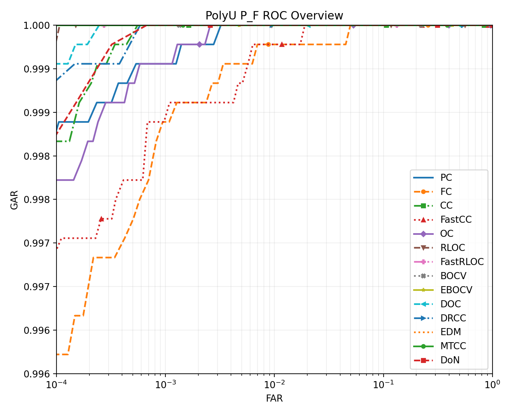

# Palmprint Recognition Python

This project is a personal Python reimplementation for study and comparison. It is not an official release from the original paper authors. If exact reproduction matters, the papers should be treated as the source of truth.
For the MATLAB version of this project, see [palmprint-recognition-matlab](https://github.com/Li-ChengYan/palmprint-recognition-matlab).
## Overview

This project provides two main workflows:

- `baseline`: generate genuine and imposter matching scores from one image folder
- `benchmark`: run a deterministic benchmark on the PolyU `P_F` subset

The project can:

- compute ROC curves
- compute EER and d-prime summary metrics
- save benchmark reports and plots under `artifacts/`

## Requirements

- Python `3.11+`
- `numpy`
- `scipy`
- `Pillow`
- `matplotlib`

## Quick Start

Run commands from the project root:

```powershell
python run.py --help
python run.py baseline --help
python run.py benchmark --help
```

## Usage

### Baseline

Use `baseline` to compute pairwise genuine and imposter scores for one image folder.

```powershell
python run.py baseline `
  --img-path D:\path\to\dataset `
  --img-form png `
  --dataset-type PolyU `
  --algorithm MTCC `
  --output-file .\artifacts\baseline_scores.npz
```
For publicly available palmprint datasets, please refer to the information collected at [IAPR TC4 Palmprint Datasets](https://iapr-tc4.org/palmprint-datasets/), or search for the corresponding official dataset pages and access instructions.

Notes:

- images must be placed directly under `--img-path`
- all images must use the extension passed to `--img-form`
- class labels are inferred from filenames through `--dataset-type`
- supported dataset types are `PolyU`, `IITD`, `Tongji`, `PolyU_CF`, `REST`, `Zhou_1295`, and `MPDv2`
- `--output-file` is optional; when provided, the command writes `genuine` and `imposter` arrays into one `.npz` file

### Benchmark

Use `benchmark` to run the documented PolyU benchmark workflow.

```powershell
python run.py benchmark `
  --img-path D:\path\to\PolyU `
  --output-dir .\artifacts\polyu_pf_100ids_full `
  --num-classes 100 `
  --images-per-class 10 `
  --algorithms PC DRCC MTCC
```

Notes:

- the built-in benchmark uses subset `P_F`
- `--img-path` must point to a folder containing PolyU images directly
- filenames must match `P_F_<class>_<sample>.bmp`
- files are sorted by class ID, subset, sample ID, and filename
- the selector keeps the first `N` classes that each have at least `M` valid images

Reference benchmark setting used in this repository:

- dataset: PolyU `P_F`
- identities: first `100`
- images per identity: `10`
- total images: `1000`

## Output Files

`baseline` can write:

- one `.npz` file containing `genuine` and `imposter` scores

`benchmark` writes:

- `benchmark_results.md`: markdown summary table
- `benchmark_results.npz`: serialized benchmark data
- `roc_overview.png`: ROC plot

## Implemented Algorithms

Representative benchmark results on PolyU `P_F` with the first `100` identities and `10` images per identity are shown below.

| Ref. | Year | Usual name | Code name | Method summary | Template size / format | EER (%) | d-prime | Extract (ms/img) | Match (ms/pair) |
| --- | ---: | --- | --- | --- | --- | ---: | ---: | ---: | ---: |
| [1] | 2003 | PalmCode | `PC` | Gabor filtering | 2 x 32 x 32, B | 0.049 | 7.067 | 8.521 | 0.393 |
| [3] | 2004 | FusionCode | `FC` | Gabor filtering at four directions, fusion strategy | 2 x 32 x 32, B | 0.110 | 5.718 | 38.644 | 0.444 |
| [2] | 2004 | CompCode | `CC` | Competitive coding in six directions | 1 x 32 x 32, I | 0.028 | 6.411 | 34.013 | 0.387 |
| [8] | 2015 | Fast-CC | `FastCC` | Two-direction CompCode variant | 1 x 32 x 32, I | 0.104 | 6.473 | 10.602 | 0.625 |
| [4] | 2005 | OrdinalCode | `OC` | Gaussian filtering in three groups | 3 x 32 x 32, B | 0.051 | 7.455 | 12.437 | 0.586 |
| [5] | 2008 | RLOC | `RLOC` | Radon competitive coding with pixel-to-area matching | 1 x 32 x 32, I | 0.005 | 9.169 | 27.964 | 36.671 |
| [8] | 2015 | Fast-RLOC | `FastRLOC` | RLOC with one-to-one matching | 1 x 32 x 32, I* | 0.000 | 5.361 | 22.185 | 0.443 |
| [6] | 2009 | BOCV | `BOCV` | Six-direction binary orientation coding | 6 x 32 x 32, B | 0.000 | 8.475 | 24.478 | 2.649 |
| [7] | 2012 | E-BOCV | `EBOCV` | BOCV with fragile-bit masks | 12 x 32 x 32, B | 0.000 | 8.194 | 25.067 | 6.109 |
| [10] | 2016 | DOC | `DOC` | Top-2 competitive codes | 2 x 32 x 32, I | 0.021 | 6.857 | 24.402 | 1.262 |
| [11] | 2016 | DRCC | `DRCC` | Competitive code and neighbor ordinal feature | 1 x 32 x 32, I | 0.041 | 5.340 | 25.108 | 0.412 |
| [13] | 2020 | EDM | `EDM` | Joint best-impact downsampling | 6 x 32 x 32, B | 0.002 | 8.128 | 29.434 | 2.640 |
| [15] | 2023 | MTCC | `MTCC` | Multi-order Gabor features | 12 x 32 x 32, B | 0.000 | 8.141 | 48.947 | 5.273 |
| [9] | 2016 | DoN | `DoN` | 3D descriptor recovered from one 2D palmprint | 3 x 128 x 128, I | 0.027 | 8.212 | 2.608 | 5.140 |

In the template size / format column, `B`, `I`, and `R` mean binary, integer, and real-valued templates, respectively.

## ROC Overview

The figure below shows the ROC overview generated from the PolyU `P_F` benchmark result.



## References

The reference numbers below are sorted by publication year, not by the original numbering in the source papers.

- `[1]` D. Zhang, W.-K. Kong, J. You, M. Wong, *Online palmprint identification*, IEEE Transactions on Pattern Analysis and Machine Intelligence, 2003.
- `[2]` A.-K. Kong, D. Zhang, *Competitive coding scheme for palmprint verification*, ICPR 2004.
- `[3]` A.W.-K. Kong, D. Zhang, *Feature-level fusion for effective palmprint authentication*, ICBA 2004.
- `[4]` Z. Sun, T. Tan, Y. Wang, S. Li, *Ordinal palmprint representation for personal identification*, CVPR 2005.
- `[5]` W. Jia, D.-S. Huang, D. Zhang, *Palmprint verification based on robust line orientation code*, Pattern Recognition, 2008.
- `[6]` Z. Guo, D. Zhang, L. Zhang, W. Zuo, *Palmprint verification using binary orientation co-occurrence vector*, Pattern Recognition Letters, 2009.
- `[7]` L. Zhang, H. Li, J. Niu, *Fragile bits in palmprint recognition*, IEEE Signal Processing Letters, 2012.
- `[8]` Q. Zheng, A. Kumar, G. Pan, *Suspecting less and doing better: New insights on palmprint identification for faster and more accurate matching*, IEEE Transactions on Information Forensics and Security, 2015.
- `[9]` Q. Zheng, A. Kumar, G. Pan, *A 3D feature descriptor recovered from a single 2D palmprint image*, IEEE Transactions on Pattern Analysis and Machine Intelligence, 2016.
- `[10]` L. Fei, Y. Xu, W. Tang, D. Zhang, *Double-orientation code and nonlinear matching scheme for palmprint recognition*, Pattern Recognition, 2016.
- `[11]` Y. Xu, L. Fei, J. Wen, D. Zhang, *Discriminative and robust competitive code for palmprint recognition*, IEEE Transactions on Systems, Man, and Cybernetics: Systems, 2016.
- `[13]` Z. Yang, L. Leng, W. Min, *Extreme downsampling and joint feature for coding-based palmprint recognition*, IEEE Transactions on Instrumentation and Measurement, 2020.
- `[15]` Z. Yang, L. Leng, T. Wu, M. Li, J. Chu, *Multi-order texture features for coding-based palmprint recognition*, Artificial Intelligence Review, 2023.
